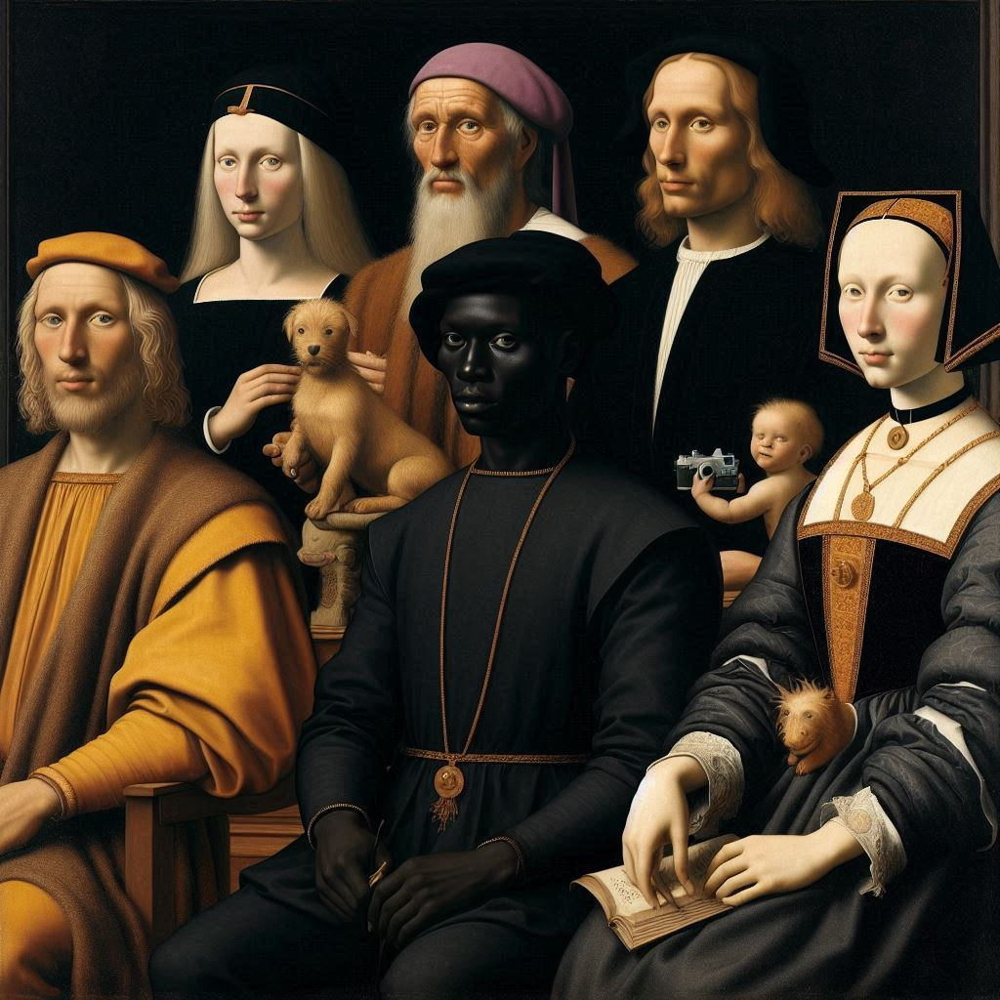
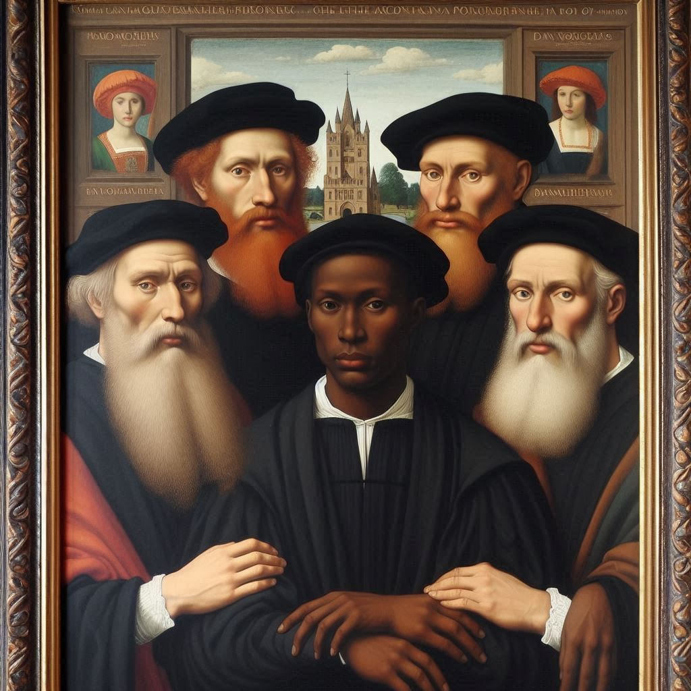

# Arte como você já viu, mas como você nunca viu

## Descrição
A arte ocidental sempre retratou pessoas brancas como o foco principal de suas criações. Isso se deve ao caráter elitista da arte, em que apenas os poderosos e ricos poderiam encomendar ou ser o foco de uma pintura. E se o mundo fosse diferente e pessoas de diversas origens tivessem o mesmo destaque?

## Tecnologias Utilizadas
 - [DALL-E](https://www.bing.com/images/create)

## Processo de Criação
Através de *prompt engineering*, buscando substituir as pessoas de pinturas famosas por pessoas de diversas origens, mantendo o estilo e a composição originais para que a pintura original seja reconhecida, ao mesmo tempo que a diferença nos personagens da pintura também seja notada.

Exemplo de prompt usado para criar uma imagem inspirada na pintura *Girl with a Pearl Earring* de Johannes Vermeer:
```
Based on Johannes Vermeer's painting named "Girl with a Pearl Earring". The girl's race should be Black and as realistic as it was taken from a professional camera in a fashion photo shoot, but she should maintain her pose from the original painting. Her clothes should look realistic and have a modern styling, but maintain the original color palette. Do not add other elements that are not present in the original painting, other than the modifications I mentioned.
```

## Resultados
### Leonardo da Vinci - Mona Lisa ([original](https://en.wikipedia.org/wiki/File:Mona_Lisa,_by_Leonardo_da_Vinci,_from_C2RMF_retouched.jpg))
<div align="center"></div>

### Johannes Vermeer - Girl with a Pearl Earring ([original](https://upload.wikimedia.org/wikipedia/commons/thumb/0/0f/1665_Girl_with_a_Pearl_Earring.jpg/270px-1665_Girl_with_a_Pearl_Earring.jpg))
<div align="center"></div>

### Jan van Eyck - The Arnolfini Portrait ([original](https://en.wikipedia.org/wiki/File:The_Arnolfini_portrait_(1434).jpg))
<div align="center"></div>

<div align="center"></div>

### Jacques-Louis David - Napoleon Crossing the Alps ([original](https://upload.wikimedia.org/wikipedia/commons/thumb/f/fd/David_-_Napoleon_crossing_the_Alps_-_Malmaison2.jpg/270px-David_-_Napoleon_crossing_the_Alps_-_Malmaison2.jpg))
<div align="center"></div>

### Claude Monet (somente estilo)
<div align="center"></div>

## Reflexão
Criar imagens de pessoas não brancas ainda é desafiador. Ao pedir por imagens de pessoas indígenas ou latinas, a IA simplesmente retorna pessoas brancas, ignorando o prompt. Pessoas asiáticas quase sempre aparecem com artefatos nos olhos. Isso dá uma pista sobre o tamanho dos bancos de imagens usadas durante a fase de treino da IA. 

Ao iniciar este projeto, havia imaginado a dominância de pessoas brancas como sendo algo do passado, da época em que as obras originais acima foram pintadas. Na verdade, a dominância ainda está muito presente, evidenciada pela falta de imagens de pessoas que não sejam brancas e a dificuldade da IA de retratar pessoas de outras etnicidades.

